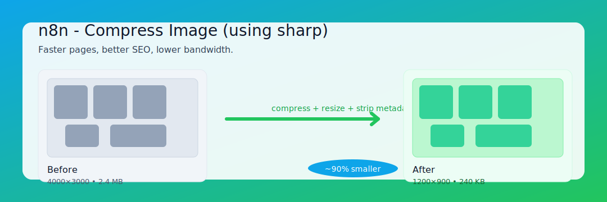
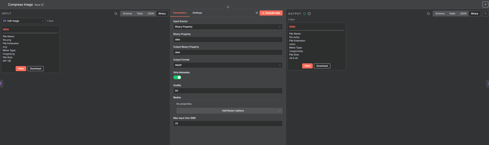

# n8n-nodes-image-compress

Compress and optionally resize images in n8n using [`sharp`](https://github.com/lovell/sharp). Optimizing image size is one of the highest-impact improvements you can make for performance and SEO:
- Smaller images load faster, improving Core Web Vitals (especially Largest Contentful Paint) and search rankings.
- Faster pages reduce bounce rates and increase conversion.
- Lower bandwidth and storage costs across your pipelines and destinations (websites, CDNs, storage buckets).
- Quicker uploads and API calls in automations that handle user-generated content.

## Disclaimer
This community node is not a verified community node by n8n. It uses a runtime dependency (`sharp`) to perform image compression and resizing. As a result:
- It won’t qualify for n8n “verified” status (verified nodes must avoid runtime dependencies).
- You should ensure your environment supports native module installation (Node.js >= 18.17.0); `sharp` bundles `libvips` for most platforms.
- If you require a verified alternative, consider delegating compression to an external HTTP optimization service and using an API-based node instead.

Learn more: n8n verification criteria — https://docs.n8n.io/integrations/community-nodes/build-community-nodes/#submit-your-node-for-verification-by-n8n

## Installation

To install a custom node in n8n, follow these steps:

- Refer to the official documentation: [n8n Custom Node Installation](https://docs.n8n.io/integrations/community-nodes/)
- Choose the custom node you want to install, for example, `n8n-nodes-image-compress`.
- Follow the instructions provided in the documentation to install and configure the custom node.

For detailed installation steps and configuration options, please visit the official n8n documentation linked above.

## Usage

1. Add the "Compress Image" node to your workflow.
2. Choose Input Source:
   - Binary Property: set the binary property name (default: `data`).
   - Base64 Field (JSON): set the field containing a Base64 string (data URL prefix is supported).
3. Select Output Format: `jpg`, `png`, `webp`, or `avif`.
4. Set Quality (0–100, default 80). Applies to JPEG/WebP/AVIF. PNG maps quality to `compressionLevel`.
5. Strip Metadata (default on) to remove EXIF/ICC for smaller files; disable to preserve metadata.
6. Optional Resize:
   - Provide width and/or height. With "Maintain Aspect Ratio" on, dimensions act as a bounding box (`fit: inside`).
   - The node won’t enlarge small images by default.
7. Output Binary Property: choose where the compressed image is stored (default: `data`).
8. Run the node. The output includes:
   - A compressed image in the specified binary property.
   - JSON metadata with `compression.originalSize`, `compression.newSize`, and `compression.percentReduction`.

## Node Options
- Input Source: Binary property or Base64 field
- Output Format: jpg, png, webp, avif
- Strip Metadata: yes/no (default yes)
- Quality: 0–100 (default 80)
- Resize: width, height, maintain aspect ratio
- Max Input Size (MB): default 25 MB

## Outputs
- Binary: compressed image in the selected output property
- JSON metadata: `compression.originalSize`, `compression.newSize`, `compression.percentReduction`

## Security & Safety
- Rejects images larger than configurable max size to prevent excessive memory usage.
- Strips metadata by default; enable `Strip Metadata` to preserve EXIF/ICC.
- Respects EXIF orientation via `.rotate()`.

## Notes
- PNG quality is mapped to `compressionLevel` (0–9) in `sharp`.

Brought to you by the friendly developers of DevToolsHub : https://www.devtoolskithub.com/
Your all-in-one developer toolkit. Format JSON, test regex patterns, decode JWTs, compress images, and more. Free developer tools with premium features.